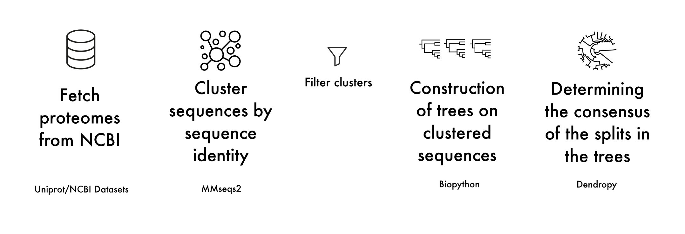

# ECT (Easy Consensus Tree)

*by Mateusz Chojnacki, Krzysztof Łukasz, Younginn Park and Daniel Zalewski*

## Overview
**Easy Consensus Tree** allows the user to easily construct a whole-proteome consensus tree based on a specified list of species names. It automates the workflow from downloading proteomes and clustering sequences to building individual cluster trees and generating a final consensus tree, ensuring a streamlined and efficient process. The user-friendly setup makes it accessible even for those with minimal bioinformatics experience.

## Workflow outline



## Requirements


To run this tool, you need to have `conda` installed. We recommend using [`miniforge`](https://github.com/conda-forge/miniforge), which is a lightweight installer for `conda`.


Instruction for installing miniforge
```{bash}
# Run
curl -L -O "https://github.com/conda-forge/miniforge/releases/latest/download/Miniforge3-$(uname)-$(uname -m).sh"
# OR
wget "https://github.com/conda-forge/miniforge/releases/latest/download/Miniforge3-$(uname)-$(uname -m).sh"
# Then
bash Miniforge3-$(uname)-$(uname -m).sh
```

## Installation

```{bash}
git clone https://github.com/M-Chojnacki6/ECT.git

# Go to the project directory
cd ECT

# Run
conda env create -f environment.yml
# mamba env create -f environment.yml # faster

# Prepare main run script to execution
chmod +x ect.sh
```

## Usage

Example usage: If the list of species called `species.txt` is located in the parent directory relative to ECT directory then run:

```
./ECT/ect.sh -i species.txt
```

>**DISCLAIMER**: We cannot guarantee that the resulting trees will accurately reflect the true relationships between species, especially if the provided species are distantly related.


## Potential future enhancements

- Option for the user to define species for an outgroup to root the tree on
- Adding supertrees (fasturec) for paralogus clusters
- Cutoff for number of sequences / number of genomes
- Type of consensus and cutoff to consensus

## References

- The UniProt Consortium, UniProt: the Universal Protein Knowledgebase in 2023, Nucleic Acids Research, Volume 51, Issue D1, 6 January 2023, Pages D523–D531, https://doi.org/10.1093/nar/gkac1052
- NCBI Datasets, https://github.com/ncbi/datasets
- Steinegger, M., Söding, J. Clustering huge protein sequence sets in linear time. Nat Commun 9, 2542 (2018). https://doi.org/10.1038/s41467-018-04964-5
- Cock PJ, Antao T, Chang JT, Chapman BA, Cox CJ, Dalke A, et al. Biopython: freely available Python tools for computational molecular biology and bioinformatics. Bioinformatics. 2009;25(11):1422–3.
- Moreno, M. A., Sukumaran, J., and M. T. Holder. 2024. DendroPy 5: a mature Python library for phylogenetic computing. arXiv preprint arXiv:2405.14120. https://doi.org/10.48550/arXiv.2405.14120
- M.A. Larkin, G. Blackshields, N.P. Brown, R. Chenna, P.A. McGettigan, H. McWilliam, F. Valentin, I.M. Wallace, A. Wilm, R. Lopez, J.D. Thompson, T.J. Gibson, D.G. Higgins, Clustal W and Clustal X version 2.0, Bioinformatics, Volume 23, Issue 21, November 2007, Pages 2947–2948, https://doi.org/10.1093/bioinformatics/btm404
- Kazutaka Katoh, Daron M. Standley, MAFFT Multiple Sequence Alignment Software Version 7: Improvements in Performance and Usability, Molecular Biology and Evolution, Volume 30, Issue 4, April 2013, Pages 772–780, https://doi.org/10.1093/molbev/mst010
- Edgar, Robert C. (2004), MUSCLE: multiple sequence alignment with high accuracy and high throughput, Nucleic Acids Research 32(5), 1792-97.
