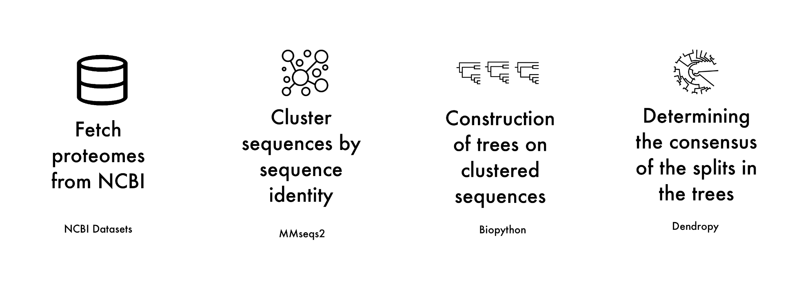

# ECT (Easy Consensus Tree)

*by Mateusz Chojnacki, Krzysztof Łukasz, Younginn Park and Daniel Zalewski*

## Overview
**Easy Consensus Tree** allows the user to easily construct a whole-proteome consensus tree based on a specified list of species names. It automates the workflow from downloading proteomes and clustering sequences to building individual cluster trees and generating a final consensus tree, ensuring a streamlined and efficient process. The user-friendly setup makes it accessible even for those with minimal bioinformatics experience.

## Workflow outline



## Requirements


To run this tool, you need to have `conda` installed. We recommend using [`miniforge`](https://github.com/conda-forge/miniforge), which is a lightweight installer for `conda`.


Instruction for installing miniforge
```{bash}
# Run
curl -L -O "https://github.com/conda-forge/miniforge/releases/latest/download/Miniforge3-$(uname)-$(uname -m).sh"
# OR
wget "https://github.com/conda-forge/miniforge/releases/latest/download/Miniforge3-$(uname)-$(uname -m).sh"
# Then
bash Miniforge3-$(uname)-$(uname -m).sh
```

## Installation

```{bash}
git clone https://github.com/M-Chojnacki6/ECT.git

# Go to the project directory
cd ECT

# Run
conda env create -f environment.yml
# mamba env create -f environment.yml # faster
```

## Usage

It is recommended to create a new folder

## TO-DO list
Our main goal is to create a tool for an easy construction of a consensus tree based on a user-defined list of species names.

- Prepare scripts for each of the steps of the workflow:
  - [x] Dowloading proteomes from database (Uniprot) (**Output: a directory with proteomes**)
  - [x] Setting up short aliases for each of the species and renaming sequences (**Output: a single multifasta file with all sequences?/proteome files with edited headers?**)
  - [x] Clustering with MMseqs2, Setting the cutoff of cluster sizes at 10% of all species by default (or 3 in case of small number of species, `max(3, 0.1*num_of_species)`), filtering non-paralgous clusters (filtering=removing whole clusters or removing individual sequences?) (**Output: tsv file for cluster memberships**) and saving clusters sequences as multifasta files (**Output: a directory with multiple multifasta files with cluster sequences**)
  - [x] MSA for each of the clusters (with Muscle, Mafft or ClustalW) (**Output: a directory with multiple multifasta files with aligned cluster sequences**)
  - [x] Tree construction for each of the clusters (NJ - watch out for negative branch weights) (**Output: file with multiple newick trees for each of the cluster**)
  - [x] Construction of consensus tree based on cluster trees with DendroPy/... (**Output: newick file**)
- [x] Prepare environment setup for the user (`.yml` file) with [mafft](https://anaconda.org/bioconda/mafft), specific python version (e.g. 3.10) and python packages (biopython, pandas, dendropy, numpy, entrez...), for this having a miniforge3 (mamba, recommended) or conda should be a requirement for the user (add to documentation)
- [ ] Prepare complete documentation for user
- [ ] Prepare pipeline in the main bash script
- [ ] Prepare options in the pipeline
- [ ] Visualize the final tree

Benchmarking
- Compare results from our tool and known phylogenetic trees
- Prepare set of examples.

Additional functionalities:
- Option for the user to define species for an outgroup
- Adding supertrees (fasturec)
- Cutoff for number of sequences / number of genomes
- Type of consensus and cutoff to consensus

## Description


 >**DISCLAIMER**: We cannot guarantee that the resulting trees will accurately reflect the true relationships between species, especially if the provided species are distantly related.

 [old scripts](https://github.com/M-Chojnacki6/ADP_working)
